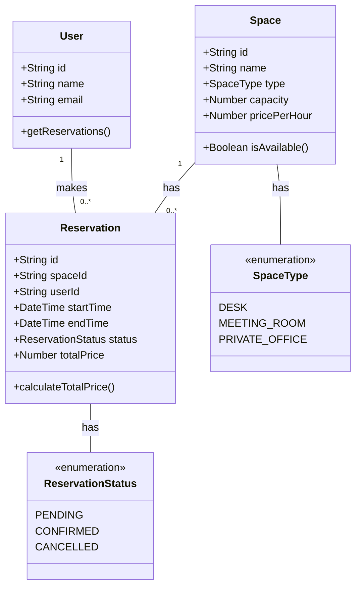

# Coworking Space Reservation System

A GraphQL-based web service for managing coworking space reservations. This system allows users to reserve desks, meeting rooms, and private offices while preventing scheduling conflicts.

## Features

- Create and manage different types of spaces (desks, meeting rooms, private offices)
- User registration and management
- Reservation system with conflict prevention
- Real-time availability checking
- Reservation status management (pending, confirmed, cancelled)
- Automatic price calculation based on duration

## Technical Stack

- Node.js
- Apollo Server
- GraphQL
- In-memory data storage (can be extended to use a database)

## Class Diagram



## Getting Started

1. Install dependencies:
```bash
npm install
```

2. Test:
```bash
node src/index.js
```

The server will start at http://localhost:4000

## GraphQL Schema

### Types

- Space: Represents a physical space (desk, meeting room, or private office)
- User: Represents a user who can make reservations
- Reservation: Represents a booking of a space by a user

### Queries

- `spaces`: Get all spaces
- `space(id)`: Get a specific space
- `users`: Get all users
- `user(id)`: Get a specific user
- `reservations`: Get all reservations
- `reservation(id)`: Get a specific reservation
- `availableSpaces(startTime, endTime)`: Get available spaces for a time slot

### Mutations

- `createSpace`: Create a new space
- `createUser`: Create a new user
- `createReservation`: Create a new reservation
- `cancelReservation`: Cancel an existing reservation
- `updateReservationStatus`: Update the status of a reservation

## Example Queries

### Create a Space
```graphql
mutation {
  createSpace(
    name: "Meeting Room A"
    type: MEETING_ROOM
    capacity: 8
    pricePerHour: 50.00
  ) {
    id
    name
    type
    capacity
    pricePerHour
  }
}
```

### Create a User
```graphql
mutation {
  createUser(
    name: "John Doe"
    email: "john@example.com"
  ) {
    id
    name
    email
  }
}
```

### Create a Reservation
```graphql
mutation {
  createReservation(
    spaceId: "space-id"
    userId: "user-id"
    startTime: "2024-03-20T10:00:00Z"
    endTime: "2024-03-20T12:00:00Z"
  ) {
    id
    space {
      name
    }
    user {
      name
    }
    startTime
    endTime
    status
    totalPrice
  }
}
```

### Check Available Spaces
```graphql
query {
  availableSpaces(
    startTime: "2024-03-20T10:00:00Z"
    endTime: "2024-03-20T12:00:00Z"
  ) {
    id
    name
    type
    capacity
    pricePerHour
  }
}
``` 