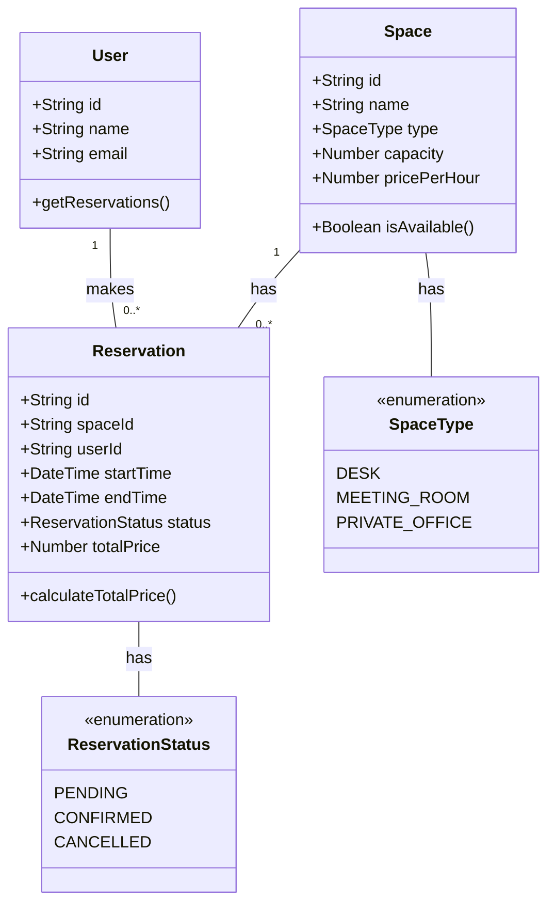

# Coworking Space Reservation System

A GraphQL-based web service for managing coworking space reservations. This system allows users to reserve desks, meeting rooms, and private offices while preventing scheduling conflicts.

## Problem Analysis

The coworking space reservation system addresses several key challenges:
1. Managing different types of spaces (desks, meeting rooms, private offices)
2. Preventing double bookings and scheduling conflicts
3. Handling user authentication and authorization
4. Calculating pricing based on duration and space type
5. Managing reservation statuses and updates

## Features

- Create and manage different types of spaces (desks, meeting rooms, private offices)
- User registration and management
- Reservation system with conflict prevention
- Real-time availability checking
- Reservation status management (pending, confirmed, cancelled)
- Automatic price calculation based on duration

## Technical Stack

- Node.js
- Apollo Server
- GraphQL
- In-memory data storage (can be extended to use a database)

## Project Structure

```
src/
├── index.js                    # Application entry point
├── schema/
│   └── typeDefs.js            # GraphQL type definitions
├── resolvers/
│   ├── index.js               # Resolver exports
│   ├── spaceResolvers.js      # Space-related resolvers
│   ├── userResolvers.js       # User-related resolvers
│   └── reservationResolvers.js # Reservation-related resolvers
└── models/
    ├── Space.js               # Space model
    ├── User.js                # User model
    └── Reservation.js         # Reservation model
```

## Class Diagram



## GraphQL Schema

### Types

#### Space
```graphql
type Space {
  id: ID!
  name: String!
  type: SpaceType!
  capacity: Int!
  pricePerHour: Float!
  reservations: [Reservation!]
}

enum SpaceType {
  DESK
  MEETING_ROOM
  PRIVATE_OFFICE
}
```

#### User
```graphql
type User {
  id: ID!
  name: String!
  email: String!
  reservations: [Reservation!]
}
```

#### Reservation
```graphql
type Reservation {
  id: ID!
  space: Space!
  user: User!
  startTime: DateTime!
  endTime: DateTime!
  status: ReservationStatus!
  totalPrice: Float!
}

enum ReservationStatus {
  PENDING
  CONFIRMED
  CANCELLED
}
```

### Queries

- `spaces`: Get all spaces
- `space(id)`: Get a specific space
- `users`: Get all users
- `user(id)`: Get a specific user
- `reservations`: Get all reservations
- `reservation(id)`: Get a specific reservation
- `availableSpaces(startTime, endTime)`: Get available spaces for a time slot

### Mutations

- `createSpace`: Create a new space
- `createUser`: Create a new user
- `createReservation`: Create a new reservation
- `cancelReservation`: Cancel an existing reservation
- `updateReservationStatus`: Update the status of a reservation

## Example Queries and Responses

### Create a Space
```graphql
mutation {
  createSpace(
    name: "Meeting Room A"
    type: MEETING_ROOM
    capacity: 8
    pricePerHour: 50.00
  ) {
    id
    name
    type
    capacity
    pricePerHour
  }
}
```

Response:
```json
{
  "data": {
    "createSpace": {
      "id": "space-123",
      "name": "Meeting Room A",
      "type": "MEETING_ROOM",
      "capacity": 8,
      "pricePerHour": 50.00
    }
  }
}
```

### Create a User
```graphql
mutation {
  createUser(
    name: "John Doe"
    email: "john@example.com"
  ) {
    id
    name
    email
  }
}
```

Response:
```json
{
  "data": {
    "createUser": {
      "id": "user-456",
      "name": "John Doe",
      "email": "john@example.com"
    }
  }
}
```

### Create a Reservation
```graphql
mutation {
  createReservation(
    spaceId: "space-123"
    userId: "user-456"
    startTime: "2024-03-20T10:00:00Z"
    endTime: "2024-03-20T12:00:00Z"
  ) {
    id
    space {
      name
    }
    user {
      name
    }
    startTime
    endTime
    status
    totalPrice
  }
}
```

Response:
```json
{
  "data": {
    "createReservation": {
      "id": "reservation-789",
      "space": {
        "name": "Meeting Room A"
      },
      "user": {
        "name": "John Doe"
      },
      "startTime": "2024-03-20T10:00:00Z",
      "endTime": "2024-03-20T12:00:00Z",
      "status": "PENDING",
      "totalPrice": 100.00
    }
  }
}
```

### Check Available Spaces
```graphql
query {
  availableSpaces(
    startTime: "2024-03-20T10:00:00Z"
    endTime: "2024-03-20T12:00:00Z"
  ) {
    id
    name
    type
    capacity
    pricePerHour
  }
}
```

Response:
```json
{
  "data": {
    "availableSpaces": [
      {
        "id": "space-123",
        "name": "Meeting Room A",
        "type": "MEETING_ROOM",
        "capacity": 8,
        "pricePerHour": 50.00
      },
      {
        "id": "space-124",
        "name": "Desk 1",
        "type": "DESK",
        "capacity": 1,
        "pricePerHour": 15.00
      }
    ]
  }
}
```

## Getting Started

1. Install dependencies:
```bash
npm install
```

2. Start the server:
```bash
node src/index.js
```

The server will start at http://localhost:4000

## Error Handling

The API uses standard HTTP status codes and returns detailed error messages in the following format:

```json
{
  "errors": [
    {
      "message": "Space is not available for the requested time slot",
      "code": "SPACE_UNAVAILABLE",
      "details": {
        "spaceId": "space-123",
        "requestedStartTime": "2024-03-20T10:00:00Z",
        "requestedEndTime": "2024-03-20T12:00:00Z"
      }
    }
  ]
}
```

Common error codes:
- `SPACE_UNAVAILABLE`: The requested space is already booked
- `INVALID_TIME_SLOT`: The requested time slot is invalid
- `USER_NOT_FOUND`: The specified user does not exist
- `SPACE_NOT_FOUND`: The specified space does not exist
- `INVALID_RESERVATION_STATUS`: Invalid reservation status transition 